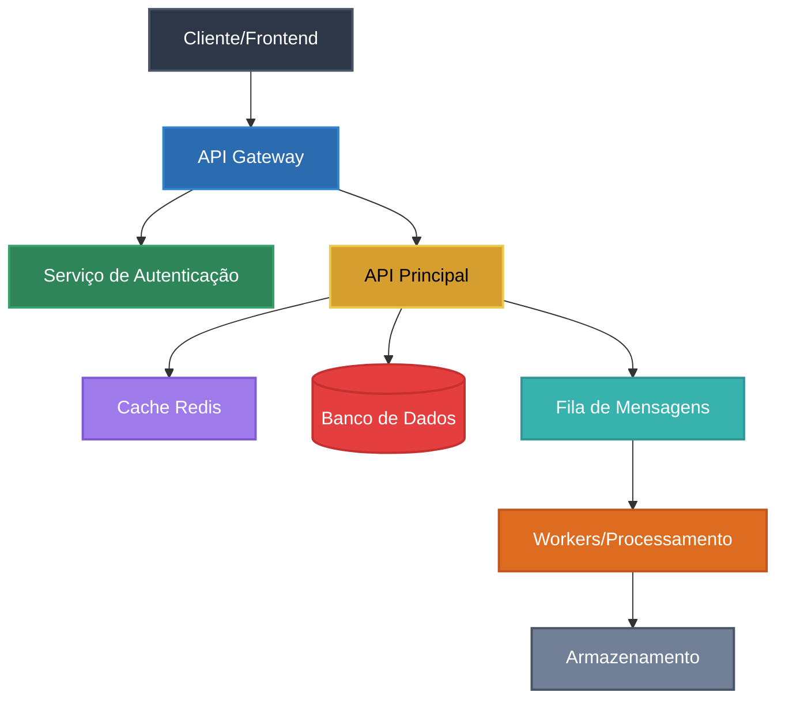
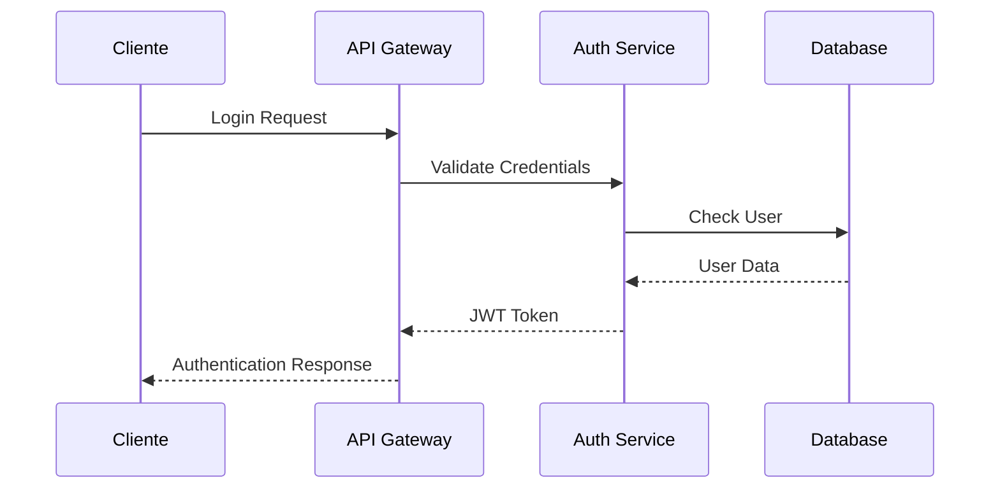
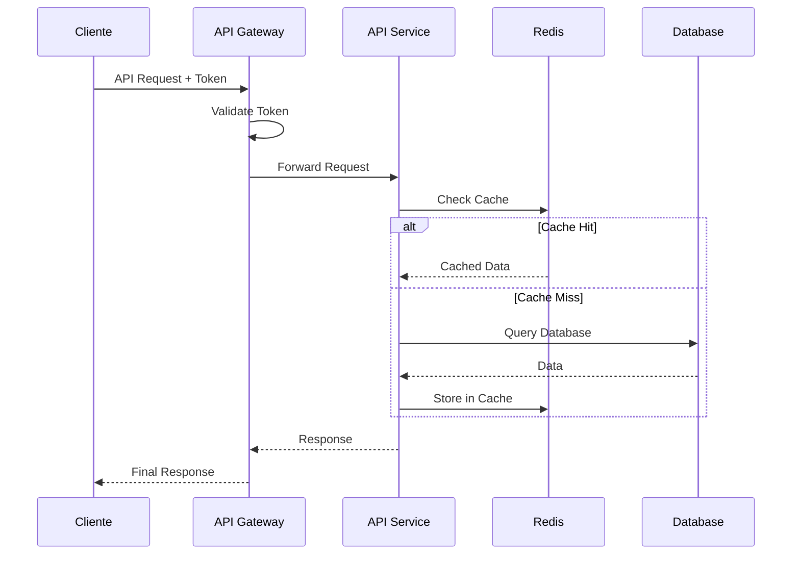

# Design de Arquitetura do Sistema

## Visão Geral

Este documento apresenta o design arquitetural do sistema, incluindo componentes principais, fluxos de dados e decisões de design.

**Última atualização**: [DATA]  
**Versão**: 1.0  
**Responsáveis**: [NOMES]

## Arquitetura de Alto Nível

### Diagrama Principal

## Componentes Principais

### Frontend/Cliente
- **Responsabilidade**: Interface do usuário
- **Tecnologia**: [React/Vue/Angular/etc]
- **Comunicação**: HTTP/HTTPS com API Gateway

### API Gateway
- **Responsabilidade**: Roteamento, autenticação, rate limiting
- **Tecnologia**: [Kong/AWS API Gateway/Nginx/etc]
- **Funcionalidades**:
  - Roteamento de requisições
  - Autenticação e autorização
  - Rate limiting e throttling
  - Logging e monitoramento

### Serviço de Autenticação
- **Responsabilidade**: Gerenciamento de usuários e sessões
- **Tecnologia**: [JWT/OAuth2/etc]
- **Funcionalidades**:
  - Login/logout
  - Gerenciamento de tokens
  - Controle de acesso

### API Principal
- **Responsabilidade**: Lógica de negócio principal
- **Tecnologia**: [Node.js/Python/Java/etc]
- **Padrões**: [REST/GraphQL/gRPC]

### Cache
- **Responsabilidade**: Cache de dados frequentemente acessados
- **Tecnologia**: Redis/Memcached
- **Estratégia**: [Cache-aside/Write-through/etc]

### Banco de Dados
- **Responsabilidade**: Persistência de dados
- **Tecnologia**: [PostgreSQL/MySQL/MongoDB/etc]
- **Padrões**: [Normalização/Desnormalização]

### Fila de Mensagens
- **Responsabilidade**: Processamento assíncrono
- **Tecnologia**: [RabbitMQ/Apache Kafka/AWS SQS/etc]
- **Padrões**: [Pub/Sub/Work Queue]

### Workers
- **Responsabilidade**: Processamento em background
- **Tecnologia**: [Celery/Bull/etc]
- **Funcionalidades**:
  - Processamento de tarefas pesadas
  - Envio de emails
  - Geração de relatórios

## Fluxos de Dados

### Fluxo de Autenticação

### Fluxo de Requisição Principal

## Decisões de Design

### Padrões Arquiteturais
- **Microserviços**: [Justificativa]
- **Event-Driven**: [Justificativa]
- **CQRS**: [Se aplicável - Justificativa]

### Tecnologias Escolhidas
- **Linguagem Backend**: [Tecnologia] - [Justificativa]
- **Banco de Dados**: [Tecnologia] - [Justificativa]
- **Cache**: [Tecnologia] - [Justificativa]
- **Message Queue**: [Tecnologia] - [Justificativa]

### Considerações de Performance
- **Caching Strategy**: [Estratégia escolhida]
- **Database Indexing**: [Índices principais]
- **Connection Pooling**: [Configuração]
- **Load Balancing**: [Estratégia]

### Considerações de Segurança
- **Autenticação**: [Método escolhido]
- **Autorização**: [RBAC/ABAC/etc]
- **Criptografia**: [Em trânsito e em repouso]
- **Rate Limiting**: [Configuração]

## Escalabilidade

### Horizontal Scaling
- **API Services**: [Estratégia]
- **Database**: [Sharding/Read Replicas]
- **Cache**: [Clustering]

### Vertical Scaling
- **Limites identificados**: [Componentes]
- **Monitoramento**: [Métricas chave]

## Monitoramento e Observabilidade

### Métricas Importantes
- **Performance**: Latência, throughput
- **Disponibilidade**: Uptime, error rates
- **Recursos**: CPU, memória, disco

### Logging
- **Structured Logging**: [Formato]
- **Centralized Logging**: [Ferramenta]
- **Log Levels**: [Configuração]

### Tracing
- **Distributed Tracing**: [Ferramenta]
- **Correlation IDs**: [Implementação]

## Disaster Recovery

### Backup Strategy
- **Database**: [Frequência e método]
- **Files**: [Estratégia]
- **Configuration**: [Versionamento]

### Recovery Procedures
- **RTO**: [Recovery Time Objective]
- **RPO**: [Recovery Point Objective]
- **Procedures**: [Documentação]

## Ambientes

### Desenvolvimento
- **Configuração**: [Detalhes]
- **Dados de Teste**: [Estratégia]

### Staging
- **Configuração**: [Detalhes]
- **Testes**: [Tipos realizados]

### Produção
- **Configuração**: [Detalhes]
- **Monitoramento**: [Ferramentas]

## Dependências Externas

### APIs Terceiros
- **[Nome da API]**: [Propósito e SLA]
- **[Nome da API]**: [Propósito e SLA]

### Serviços Cloud
- **[Serviço]**: [Uso e configuração]
- **[Serviço]**: [Uso e configuração]

## Limitações Conhecidas

### Técnicas
- [Limitação 1]: [Descrição e impacto]
- [Limitação 2]: [Descrição e impacto]

### Negócio
- [Limitação 1]: [Descrição e impacto]
- [Limitação 2]: [Descrição e impacto]

## Roadmap Técnico

### Próximas Melhorias
- [ ] [Melhoria 1]: [Descrição e prazo]
- [ ] [Melhoria 2]: [Descrição e prazo]
- [ ] [Melhoria 3]: [Descrição e prazo]

### Refatorações Planejadas
- [ ] [Refatoração 1]: [Descrição e justificativa]
- [ ] [Refatoração 2]: [Descrição e justificativa]

## Referências

### Documentação Técnica
- [ADRs Relacionados](../decisions/)
- [Documentação de APIs](../../apis/)
- [Guias de Deploy](../../deployment/)

### Recursos Externos
- [Documentação da tecnologia X](URL)
- [Best practices Y](URL)
- [Padrões arquiteturais Z](URL)

## Glossário

- **API Gateway**: [Definição]
- **Microserviço**: [Definição]
- **CQRS**: [Definição]
- **Event Sourcing**: [Definição]

---

**Nota**: Este documento deve ser atualizado sempre que houver mudanças significativas na arquitetura. Para mudanças menores, considere criar um ADR específico.
