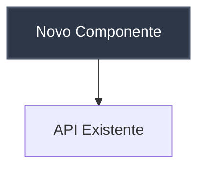

# Contribuindo com a Documentação de Arquitetura

Este documento orienta como contribuir e melhorar a documentação de arquitetura do projeto, incluindo design de sistema e Architecture Decision Records (ADRs).

## Visão Geral da Estrutura

A documentação de arquitetura está organizada em:

```
docs/architecture/
├── design/
│   └── index.md          # Design geral do sistema
├── decisions/
│   ├── README.md         # Guia para ADRs
│   ├── template.md       # Template para novos ADRs
│   └── *.md             # ADRs individuais
└── README.md            # Visão geral da arquitetura
```

## Melhorando o Design de Arquitetura

### Documentação Principal: `docs/architecture/design/index.md`

Este arquivo contém o design geral do sistema e deve ser mantido atualizado conforme a arquitetura evolui.

#### Como Contribuir

1. **Atualizações de Componentes**
   - Adicione novos componentes ao diagrama principal
   - Atualize descrições de componentes existentes
   - Mantenha as cores do diagrama consistentes (otimizadas para tema escuro)

2. **Fluxos de Dados**
   - Adicione novos diagramas de sequência para fluxos importantes
   - Atualize fluxos existentes quando houver mudanças
   - Use Mermaid para consistência visual

3. **Decisões de Design**
   - Documente justificativas para escolhas tecnológicas
   - Atualize considerações de performance e segurança
   - Mantenha seção de limitações conhecidas atualizada

#### Exemplo de Atualização de Componente



#### Boas Práticas para Diagramas

- Use cores consistentes (tema escuro otimizado)
- Mantenha diagramas simples e legíveis
- Adicione legendas quando necessário
- Atualize diagramas junto com mudanças de código

### Seções Importantes a Manter

1. **Componentes Principais** - Sempre atualize quando adicionar/remover serviços
2. **Fluxos de Dados** - Essencial para entendimento do sistema
3. **Decisões de Design** - Justifique escolhas arquiteturais
4. **Escalabilidade** - Documente estratégias de crescimento
5. **Monitoramento** - Mantenha métricas e alertas atualizados

## Criando Architecture Decision Records (ADRs)

### Documentação de Referência: `docs/architecture/decisions/README.md`

Consulte este arquivo para instruções completas sobre criação de ADRs.

#### Quando Criar um ADR

Crie um ADR sempre que houver:
- Mudanças significativas na arquitetura
- Escolha entre tecnologias alternativas
- Decisões que impactam múltiplos componentes
- Padrões arquiteturais novos ou modificados
- Mudanças em estratégias de dados ou segurança

#### Processo Rápido

1. **Copie o template**:
   ```bash
   cp docs/architecture/decisions/template.md docs/architecture/decisions/$(date +%Y-%m-%d)-titulo-da-decisao.md
   ```

2. **Preencha as seções obrigatórias**:
   - Título descritivo
   - Data atual
   - Status (proposto/aceito/substituído)
   - Contexto da decisão
   - Decisão tomada
   - Consequências

3. **Revise e aprove**:
   - Submeta para revisão da equipe
   - Atualize o design principal se necessário
   - Marque como "aceito" após aprovação

#### Exemplo de Nomenclatura

```
2024-07-23-migracao-banco-postgresql.md
2024-07-24-implementacao-cache-redis.md
2024-07-25-padrao-autenticacao-jwt.md
```

## Fluxo de Trabalho Recomendado

### Para Mudanças Arquiteturais

1. **Análise** - Avalie impacto da mudança
2. **ADR** - Crie ADR documentando a decisão
3. **Design** - Atualize `docs/architecture/design/index.md`
4. **Implementação** - Realize as mudanças no código
5. **Validação** - Confirme que documentação reflete a realidade

### Para Melhorias na Documentação

1. **Identifique gaps** - Encontre áreas mal documentadas
2. **Priorize** - Foque em componentes críticos primeiro
3. **Atualize** - Melhore documentação existente
4. **Valide** - Confirme com a equipe técnica
5. **Mantenha** - Estabeleça processo de atualização regular

## Integrações com Outras Documentações

### Referências Cruzadas

- **Tasks**: Referencie ADRs em `docs/tasks/[TASK_CODE]/technical-analysis.md`
- **Pull Requests**: Mencione ADRs relevantes em PRs
- **APIs**: Documente decisões de design de API em ADRs
- **Deploy**: Referencie decisões de infraestrutura

### Exemplo de Referência

```markdown
Esta implementação segue a decisão arquitetural documentada em 
[ADR-001: Escolha do Banco de Dados](../architecture/decisions/2024-07-23-escolha-banco-dados.md)
```

## Ferramentas e Recursos

### Diagramas Mermaid

- **Documentação**: [Mermaid Documentation](https://mermaid-js.github.io/mermaid/)
- **Editor Online**: [Mermaid Live Editor](https://mermaid.live/)
- **Tipos Úteis**: 
  - `graph TD` - Diagramas de fluxo
  - `sequenceDiagram` - Diagramas de sequência
  - `classDiagram` - Diagramas de classe

### Cores Padrão (Tema Escuro)

```css
/* Componentes principais */
fill:#2d3748,stroke:#4a5568,stroke-width:2px,color:#ffffff

/* Serviços */
fill:#2b6cb0,stroke:#3182ce,stroke-width:2px,color:#ffffff

/* Dados */
fill:#2f855a,stroke:#38a169,stroke-width:2px,color:#ffffff

/* Processamento */
fill:#d69e2e,stroke:#ecc94b,stroke-width:2px,color:#000000
```

## Revisão e Qualidade

### Princípios de Documentação

#### Concisão e Clareza
- **Seja direto**: Evite explicações desnecessariamente longas
- **Use linguagem simples**: Prefira termos técnicos precisos mas acessíveis
- **Elimine redundâncias**: Não repita informações já documentadas em outros locais
- **Foque no essencial**: Documente apenas o que é necessário para entendimento

#### Evitando Duplicações
Antes de adicionar nova informação, verifique se ela já existe em:
- Outros ADRs relacionados
- Documentação de design existente
- README de componentes específicos
- Documentação de APIs

**Estratégias para evitar duplicação:**
- Use referências cruzadas ao invés de repetir conteúdo
- Centralize informações comuns em um local único
- Mantenha apenas um "source of truth" por tópico
- Revise regularmente para identificar conteúdo duplicado

#### Exemplo de Referência ao Invés de Duplicação
```markdown
❌ Ruim - Duplicando informação:
A autenticação utiliza JWT tokens com expiração de 24 horas...

✅ Bom - Referenciando:
Para detalhes sobre autenticação, consulte [ADR-003: Implementação JWT](../decisions/2024-07-23-implementacao-jwt.md)
```

### Checklist para ADRs

- [ ] Título claro e descritivo
- [ ] Data preenchida corretamente
- [ ] Status definido
- [ ] Contexto bem explicado
- [ ] Alternativas consideradas documentadas
- [ ] Consequências identificadas
- [ ] **Informações não duplicadas de outros ADRs**
- [ ] **Conteúdo conciso e direto ao ponto**
- [ ] Revisão da equipe realizada

### Checklist para Design

- [ ] Diagramas atualizados
- [ ] Componentes novos documentados
- [ ] Fluxos de dados corretos
- [ ] Tecnologias atualizadas
- [ ] Limitações conhecidas documentadas
- [ ] Roadmap técnico atualizado
- [ ] **Informações não repetidas em múltiplas seções**
- [ ] **Descrições concisas e objetivas**
- [ ] **Referências cruzadas utilizadas adequadamente**

## Manutenção Contínua

### Responsabilidades

- **Tech Leads**: Garantir que ADRs sejam criados para decisões importantes
- **Desenvolvedores**: Atualizar documentação durante implementação
- **Arquitetos**: Revisar e aprovar mudanças arquiteturais
- **Todos**: Identificar e reportar inconsistências

### Frequência de Revisão

- **Mensal**: Revisão geral da documentação de design
- **Por Sprint**: Verificação de ADRs pendentes
- **Por Release**: Atualização completa da arquitetura
- **Ad-hoc**: Sempre que houver mudanças significativas

## Recursos Adicionais

### Documentações Relacionadas

- [Guia de Tasks](./tasks.md) - Como documentar tarefas técnicas
- [Guia de Pull Requests](./pull_requests.md) - Como referenciar arquitetura em PRs
- [Guia de Commits](./commits.md) - Como mencionar ADRs em commits

### Templates Úteis

- `docs/architecture/decisions/template.md` - Template para ADRs
- `docs/architecture/design/index.md` - Template de design completo

### Ferramentas Externas

- [C4 Model](https://c4model.com/) - Para diagramas de arquitetura
- [PlantUML](https://plantuml.com/) - Alternativa ao Mermaid
- [Draw.io](https://draw.io/) - Para diagramas complexos

---

**Lembre-se**: A documentação de arquitetura é um documento vivo que deve evoluir junto com o sistema. Mantenha-a atualizada e útil para toda a equipe.
